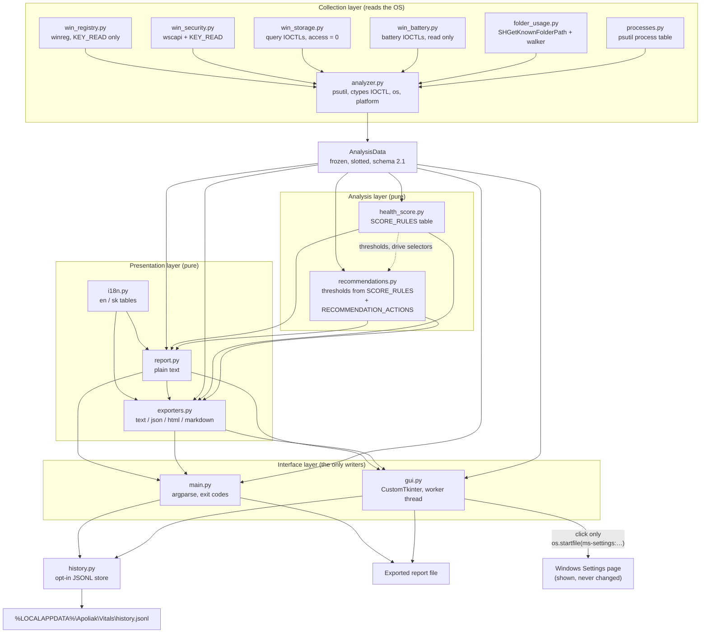

# Architecture

Apoliak Vitals separates collection from presentation with one hard boundary: the
collectors touch the operating system, build a single immutable `AnalysisData` snapshot, and
then never call an OS API again. Everything downstream — score, advice, translation,
rendering, export, history — is a pure function of that snapshot. Two views of the same run
therefore cannot disagree, and every downstream module is testable without a real machine.

v2.1 adds four collectors on the OS side of that boundary and one — and only one — call that
crosses back out of the process: the GUI may open a Windows Settings page when the user
clicks a button. That call is described in [The settings-page
boundary](#the-settings-page-boundary) and is the reason `tests/test_readonly.py` exists.

## Modules

### Collection layer

- **`src/analyzer.py`** — the only module that orchestrates a run. Each collector
  (`get_system_info`, `get_cpu_info`, `get_ram_info`, `get_disk_info`, `get_partitions`,
  `get_drive_health`, `get_process_count`, `get_battery`, `get_network`,
  `get_temp_locations`, `get_folder_usage`, `get_security`, `get_uptime`) is independently
  wrapped by `analyze_pc`, so one platform failure costs one value and adds one warning. Also
  hosts `detect_media_type`, the SSD/HDD classifier: a `ctypes` volume handle opened with
  `dwDesiredAccess = 0` plus two query-only IOCTLs, cached per drive letter because the round
  trip is slow.
  `_default_temp_path()` resolves TEMP from `TMP` / `TEMP` / `TMPDIR` and only falls through
  to `tempfile.gettempdir()` when none is set, because `gettempdir()` writes a probe file on
  first use. Taking the environment value as given is a trade-off, and
  `get_temp_locations()` is where it is paid for honestly: `_is_listable_directory()` checks
  each candidate with `os.path.isdir` plus one `os.scandir` open and one entry read, and a
  path that fails is recorded with `size_bytes=None` and a warning rather than scanned.
  `utils.scan_folder` answers `(0, 0, False)` for a path that does not exist, which is
  indistinguishable from a genuinely empty folder — so the existence check has to live here,
  above the frozen `utils`. `analyze_pc` lifts the user-TEMP entry's `truncated` flag onto
  the snapshot as `AnalysisData.temp_truncated`, which is what the analysis layer reads.
  It also owns the **shared scan budget** (`TOTAL_SCAN_SECONDS = 8.0`): `_temp_budget()`
  gives TEMP its half unless the caller named a figure, and `_folder_budget()` hands the
  folder scan whatever is left, floored at one second, measured from when the TEMP scan
  started rather than from a fresh clock. Adding the folder measurement therefore cannot
  double the length of a run.
  Finally it exposes `PROGRESS_LABELS`, the step-key → English-label map behind its
  `progress` callback; see the interface layer below.
- **`src/win_registry.py`** — the general registry lookups: edition, firmware, processor
  name, GPUs, startup entries. Keys are opened with `KEY_READ` only, and nothing here raises:
  a missing key, a denied permission, or a non-Windows platform all produce an empty result.
  The registry is used *instead of* WMI/PowerShell on purpose — a subprocess would be slower,
  would flash a console window in the packaged GUI, and would weaken the promise that the
  tool only reads.
- **`src/win_security.py`** *(new in 2.1)* — `read_security_state()` → `SecurityInfo`. One
  Security Center call (`wscapi.WscGetSecurityProviderHealth`, provider `0x1` firewall and
  `0x4` antivirus) plus `KEY_READ` reads for the firewall profiles, Secure Boot, the two
  reboot-marker keys, `PendingFileRenameOperations`, and Defender's signature and scan
  timestamps. Two rules shape every verdict: **a failed query is `unknown`, never `bad`**,
  and **nothing is guessed** — `antivirus_name` needs COM/WMI, which this project does not
  use, so it is always `None` rather than a plausible-sounding "Windows Defender". The
  Security Center is preferred over a Defender-specific probe because it also covers
  third-party antivirus. `provider_health` and `now` are injectable, so a test can describe a
  machine without owning one.
- **`src/win_storage.py`** *(new in 2.1)* — `read_drive_health(drives)` → `list[DriveHealth]`.
  Three query IOCTLs on handles opened with `dwDesiredAccess = 0`:
  `IOCTL_VOLUME_GET_VOLUME_DISK_EXTENTS` for the disk number,
  `IOCTL_STORAGE_QUERY_PROPERTY`/`StorageDeviceProperty` for model and bus type, and
  `IOCTL_STORAGE_QUERY_PROPERTY`/`StorageDeviceProtocolSpecificProperty` for the NVMe SMART
  health log page. One physical disk answers once however many volumes it carries; a disk
  that reports nothing at all is left out rather than padding the table with `N/A`. **The
  descriptor's serial-number field is deliberately skipped** and the offset is documented
  only to record that. Plausibility limits (temperature 233–398 K, ≤ 10⁶ power-on hours,
  ≤ 1 EB written) drop a filler answer, because a wrong number is worse than no number.
- **`src/win_battery.py`** *(new in 2.1)* — `read_battery_health()` → a dict of optional keys.
  `setupapi` enumerates the present `GUID_DEVCLASS_BATTERY` interfaces, then
  `IOCTL_BATTERY_QUERY_TAG` and `IOCTL_BATTERY_QUERY_INFORMATION` return design capacity,
  full-charge capacity, cycle count and chemistry. **This is the one device handle in the
  project that may exceed zero access**: the battery control codes are `FILE_READ_ACCESS`, so
  `_ACCESS_LEVELS = (0, GENERIC_READ)` tries zero first and falls back — still unelevated,
  verified from a standard account, and `GENERIC_WRITE` is never requested. Relative-capacity
  packs are dropped rather than reported in a unit the firmware never published.
- **`src/folder_usage.py`** *(new in 2.1)* — `read_folder_usage(max_seconds, limit)` →
  `list[FolderUsage]`, biggest first. Paths come from `SHGetKnownFolderPath` with
  `KF_FLAG_DEFAULT` (never `KF_FLAG_CREATE`), because Documents and Desktop are routinely
  redirected into OneDrive and a `%USERPROFILE%` join would measure an empty leftover and
  report a reassuring, wrong number; the join stays only as the fallback for a failed shell
  call. The whole set shares one budget, each folder claiming what is left minus a reserve
  (`_MIN_FOLDER_SECONDS = 0.5`) held back for the folders behind it, so a huge AppData cannot
  starve the rest of the table. `packages` is a fixed subfolder of Local app data and its
  bytes are counted in both rows on purpose: "all application data" and "Store app data"
  answer different questions and both numbers are true.
- **`src/processes.py`** — the process ranking. Dead and access-denied processes are
  skipped per item, so a partial ranking survives. CPU figures always take two readings
  `CPU_SAMPLE_SECONDS` (0.15 s) apart, because psutil returns 0.0 the first time it is asked
  about a process, and are divided by the logical core count, which is what Task Manager
  shows. `sample_cpu=True` fills that column in without changing a memory ranking: the
  counters are primed for the ranked processes only and share one pause for the whole list,
  so the memory-sorted report `analyze_pc` asks for still costs about 0.15 s, not 0.15 s per
  process. `limit=0` skips the work entirely.

Every new module follows the same shape: **the Win32 plumbing sits behind two or three small
seams** — `_load_kernel32` / `_open_device` / `_device_io_control`, `_load_api`,
`_load_shell_api`, or an injected `provider_health` — so a test replaces the operating system
wholesale, while every buffer decoder is a pure `bytes → value` function that needs no
hardware at all. Each one also returns its safe empty value when `platform.system()` is not
`"Windows"`, and the suite asserts that with `platform.system` monkeypatched to `"Linux"`.

### Contract

- **`src/models.py`** — frozen, slotted dataclasses; `SCHEMA_VERSION = "2.1"`; the category
  constants (including `CATEGORY_SECURITY`), the `STATE_GOOD` / `STATE_WEAK` / `STATE_BAD` /
  `STATE_UNKNOWN` verdicts, and `severity_rank`. Every field added after v1.0 carries a
  default, so an older snapshot still constructs cleanly. Two derived properties live here
  rather than in a collector, because they are arithmetic over fields the snapshot already
  holds: `BatteryInfo.health_percent` (full ÷ design, `None` when either is missing) and
  `DriveHealth.life_left_percent` (`100 − percentage_used`).
- **`src/utils.py`** — formatting (`format_bytes`, `format_percent`, `format_uptime`,
  `format_frequency`, `format_count`, `format_duration`), `redact_text`, the `Ansi` helper,
  and `scan_folder`, the defensive folder walker that refuses to follow symlinks or Windows
  reparse points and honours a wall-clock budget, checked per directory as well as every 128
  entries so a stalled network share cannot outlast it. `redact_text` matches a
  `X:\Users\<name>` or `X:/Users/<name>` segment anywhere in a string, not only at the
  start, which is what masks a profile path quoted inside a startup command. `scan_folder` is
  shared verbatim by the TEMP measurement and by `folder_usage`, so both inherit the same
  refusals.

Both files are the frozen contract: everything else depends on them, and they depend on
nothing in the project.

### Analysis layer

- **`src/health_score.py`** — `SCORE_RULES` is a table, not a black box: **50 rows across 17
  measurements**. Each row names a metric, a threshold, a tier, a point cost, and a severity,
  and `score_rules()` returns it in documentation order so the README cannot drift from the
  code. `METRICS` owns each measurement's category and comparison direction, so a rule row
  cannot file itself under the wrong area. `calculate_health_details` produces the overall
  score, the deductions, and the **six** `CategoryScore` sub-scores (CPU, Memory, Storage,
  Maintenance, Power, Security).
  It also owns **the single definition of "complete"**: the public
  `required_values_present(data)` is true when CPU usage, RAM usage, free disk space,
  process count, TEMP size and uptime are all present **and** `temp_truncated` is false. The
  v2.1 readings deliberately stay out of that predicate — a desktop has no battery and a SATA
  drive publishes no wear figure, and calling those an incomplete *analysis* would make the
  flag meaningless. `HealthAssessment.data_complete` is that predicate, and
  `recommendations.py` imports it rather than restating it.
  A truncated TEMP scan still lets `large_temp` fire — a partial size is a valid lower bound,
  and firing on a floor can only be too mild — but the deduction is marked as bounded rather
  than reworded here: its `value` param carries the plain formatted measurement and a
  separate `LOWER_BOUND_PARAM` (`("bound", "lower")`) says the number is a floor. Only the
  English `reason` string on the object itself spells the qualifier out, via
  `english_lower_bound()`, because that string is the last resort for a consumer with no
  translator at all.

  The v2.1 rules bring three shared helpers, all public because the advice layer imports them
  rather than re-deriving the same answer:

  - `state_level(state)` places a protection verdict on a ladder — `good` 0, `weak` 1,
    `bad` 2 — and returns `None` for `unknown` and for anything that is not a known verdict,
    which is what keeps an unreadable Security Center out of the score entirely.
  - `most_worn_drive(drives)` picks the disk with the least life left, ties broken by drive
    letter. **One deduction per snapshot, not one per disk**: a PC with two worn drives has
    one problem to act on, and charging twice would make the score depend on how many disks
    are fitted.
  - `failing_drive(drives)` picks the first disk that raised its own critical warning, in a
    deterministic order.

  `_drive_warning_level()` stays `None` until at least one disk actually answered, because
  "no drive told us" and "every drive said it is fine" are different facts and only the
  second may report Storage as measured. `_flag_level()` does the same for the pending-restart
  boolean: anything that is not a `bool` is unknown.

  There is deliberately **no rule row for `secure_boot_state`.** It is a `Metric` — so the
  category and direction exist for the advice — and it costs nothing. Secure Boot is off for
  many legitimate reasons, and penalising a dual-boot machine would be dishonest.
- **`src/recommendations.py`** — maps snapshot conditions onto safe user actions. Its
  thresholds are read out of `SCORE_RULES` at import time rather than written a second
  time, so the report can never deduct points for something it fails to mention, or advise
  on something the score considered fine. The same reasoning governs the drive: advice reads
  `data.disk`, the drive the snapshot is *about* (`analyze_pc(drive=…)` can point it away
  from `C:`), which is the same record the score reads, and it imports `most_worn_drive()` and
  `failing_drive()` so a wear sentence can never name a different disk than the deduction
  above it. Every sentence points at a tool Windows already ships; nothing here performs the
  action it describes.

  Coverage is the second invariant, and it is absolute: **no deduction key may be emitted
  without a recommendation covering the same condition, and `all_good` is only ever emitted
  alone.** Every mild tier that costs points therefore has an `info`-severity partner —
  `medium_cpu`, `medium_ram`, `medium_swap`, `medium_disk`, `medium_disk_full`,
  `some_processes`, `medium_temp`, `medium_uptime` — each reading its threshold from the
  same `mild` row the score charges on, and each v2.1 rule has its own key too. The storage
  branch also mirrors the score's free-bytes-wins suppression rule, so advice never answers a
  "49.0 GB free" deduction with a "90% full" sentence. `_make(..., lower_bound=True)`
  attaches the same `LOWER_BOUND_PARAM` the score uses, so a truncated size is quoted as a
  floor by the advice as well as by the deduction — now for `large_folder` as well as for
  the two TEMP keys.

  Two keys exist with no deduction behind them, by design: `secure_boot_off` (advice only,
  explained above) and `large_folder`, which fires when the biggest measured folder exceeds
  `LARGE_FOLDER_BYTES` (20 GiB) **or** `LARGE_FOLDER_DRIVE_PERCENT` (10% of its drive). Both
  tests are needed — 20 GB is a lot on a 256 GB laptop and unremarkable on a 4 TB desktop —
  and `_largest_folder()` excludes the TEMP path, because TEMP already has its own finding
  and reporting one measurement under two names would be double-counting.

  **`RECOMMENDATION_ACTIONS`** is a constant map of recommendation key → `ms-settings:` page,
  eleven entries over five distinct pages, and `_make()` reads `action_uri` from it. Keeping
  it in one table is what stops two producers attaching different pages to the same key.
  Three keys are deliberately absent — `secure_boot_off` (the switch lives in firmware),
  `drive_worn` and `drive_failing` (no settings page undoes physical wear) — because a wrong
  page is worse than none.

### Presentation layer

- **`src/i18n.py`** — the English and Slovak tables, **418 keys each** with identical
  placeholders per key, and **the single source of the rendered wording**. Rendering modules
  never hardcode a finished sentence: they ask for a key and pass an English default, so a
  missing translation degrades to English instead of breaking a report. A placeholder nobody
  supplied a value for is dropped together with its surrounding `(...)` segment rather than
  printing `(N/A)`. `Translator.t_plural()` and `plural_form()` keep count-dependent phrases
  correct: the number of forms is a property of the language, not of the renderer, so Slovak
  gets 1 `bod` / 2–4 `body` / 0 and 5+ `bodov` where English gets `point` / `points`. Every
  shipped key has a call site — a catalogue entry nothing renders is a promise the product
  does not keep, so an orphan is either wired up or removed from both tables.
- **`src/report.py`** — the plain-text renderer, shared by the console, the GUI preview,
  and the text exporter. A section with no data is omitted rather than printed empty, and
  each section is built behind its own `try`, so one damaged measurement costs one section
  and not the report. It also owns the two helpers every format shares: `_text()`, the
  "translate or fall back to the caller's English" rule, and `_qualified()`, which turns a
  producer's `bound` parameter into a worded qualifier through `_BOUND_KEYS`
  (`"lower"` → `report.at_least`) *before* the value reaches the sentence. Because all four
  formats resolve a bound in the same place, they cannot end up quoting one measurement two
  different ways, and neither language sees the other's phrasing. v2.1 added the
  `DRIVE HEALTH`, `BIGGEST FOLDERS` and `SECURITY` sections behind the same per-section
  guard as the rest.
- **`src/exporters.py`** — `snapshot_to_dict` plus the JSON, HTML, and Markdown renderers;
  text delegates to `report.build_report`. The HTML and Markdown documents are assembled
  through the shared `_sections()` helper, which gives them the same per-section net the
  text builder has and merges a section's lines only once the step finished — so a failure
  can never leave a half-open table or list behind. `snapshot_to_dict` has the same net
  through `_json_section()`: every branch is built inside a guard and proved serialisable
  with a `json.dumps` round trip, so a hostile *type* is caught as well as a hostile value.
  A branch that fails becomes `null` — unknown, like any other value nobody could produce —
  and names itself in the payload's `export_errors` list, which is empty on a healthy
  export. `render()` raises `ValueError`, and only `ValueError`, for an unknown format name.
  The HTML document is deliberately self-contained: no fonts, no scripts, no images, nothing
  that reaches outside the file when the report is e-mailed.

### The single-source-of-wording rule

`build_report()`, `exporters.render()`, and `exporters.snapshot_to_dict()` all resolve
`translator=None` to `i18n.get_translator("en")` rather than printing the sentence the
producing module happened to build. The `text` on a `Recommendation` and the `reason` on a
`ScoreDeduction` are a **last-resort fallback**, used only when the key is genuinely absent
from the catalogue (or when i18n cannot be imported at all, as in a trimmed install).

The consequence is the point: the JSON, text, HTML, and Markdown of one run always describe
a finding with the same words and the same numbers, and a support ticket that quotes the
JSON matches the HTML the user is looking at.

### Interface layer

- **`main.py`** — argparse, validation, the exit-code contract, the progress line, and the
  interactive export question. The parser itself is translated: `_requested_language()`
  scans `argv` for `--lang` *before* argparse exists, because argparse prints the help text
  the parser was built with. `_ProgressLine.update()` receives a step key, not a sentence,
  and renders `progress.<key>` in the language this run asked for. Status notes are routed
  to stderr whenever stdout carries machine-readable output, so `--format json > file` stays
  valid JSON. Every render and export call is wrapped, so a renderer defect produces the
  standard "Analysis failed safely" message and exit code 1 instead of a traceback. The v2.1
  collectors have no flags of their own: the console calls `analyze_pc` without
  `include_security`, `include_drive_health` or `scan_folders`, so all three run at their
  defaults.
- **`gui.py`** — the CustomTkinter window, six views. It imports `i18n`, `exporters`, and
  `history` defensively, so a trimmed installation still opens in English rather than dying
  on an import; `PROGRESS_LABELS` is read lazily off the analyzer module for the same reason.
  `_run_analysis()` goes further and filters its keyword arguments through
  `inspect.signature(analyze_pc)`, so a collector that predates the v2.1 parameters still
  drives the window. The **Redact personal data** checkbox lives with the export controls and
  is read on the UI thread at the moment of every export and clipboard copy; a writer that
  cannot accept the `redact` keyword makes the export fail loudly rather than write unmasked.
  The History view draws the score-over-time chart on a `CTkCanvas` (with a plain `tkinter`
  fallback for a very old CustomTkinter) and rebinds `<Configure>` so the first draw's
  fallback width is corrected as soon as Tk has laid the canvas out.
- **`src/history.py`** — the opt-in JSON Lines store. Unchanged in v2.1: nine numeric fields,
  and none of the new state data is written to it.

### The progress contract

`analyze_pc(progress=...)` calls its callback as **`(step_key, fraction)`**: a stable key
from `analyzer.PROGRESS_LABELS` and a float clamped to 0.0–1.0. The key is deliberately not
a sentence — only the caller knows which language its interface speaks, and a collector must
not hand it English prose it then has to guess at. Consumers render
`translator.t(f"progress.{key}", PROGRESS_LABELS[key])`, so a catalogue missing a step still
shows readable English while a complete one shows the chosen language. The **thirteen** steps
are `system`, `cpu`, `ram`, `disk`, `partitions`, `drive_health`, `processes`,
`top_processes`, `temp`, `folders`, `security`, `extras` and `done`. `_notify()` swallows
anything the callback raises: a broken indicator is never worth losing an analysis over.

`drive_health` earned its own step for the same reason `partitions` did: a machine with
several disks spends real time there, and a progress line that sat on "Reading drives" for
seconds looked stuck rather than busy.

## The settings-page boundary

This is the only place in the project where the application asks the operating system to do
something rather than to answer something, and the architecture is deliberately narrow.

- **The data.** `Recommendation.action_uri` is a plain optional string filled from
  `recommendations.RECOMMENDATION_ACTIONS`. It travels through the snapshot and into the JSON
  export as data. No renderer, no exporter and no analysis code ever follows it.
- **The fence.** `gui.is_settings_uri(value)` is a pure predicate: it requires the literal
  lower-case prefix `ms-settings:` and then matches
  `^ms-settings:[A-Za-z0-9._~%!$&*+,;=:@/?-]*$`. Anything else — a different scheme, a
  different capitalisation, a space, a quote, a backslash, a newline, a non-string — is
  **refused, not repaired**. It is a module-level function so a test can call it without a
  display.
- **The single call site.** `ApoliakAnalyzerApp.open_setting(uri)` re-checks the fence,
  looks `os.startfile` up (absent off Windows, in which case nothing runs), calls it with the
  URI as its only argument — never with `operation="runas"` — and turns any failure into a
  status line rather than a traceback. It is bound only to a button's `command`, and each
  button binds its own row's URI by default argument so a later row cannot change what an
  earlier one opens.
- **The proof.** `tests/test_readonly.py` runs `analyze_pc` and all four renderers under
  `sys.addaudithook()` in a child interpreter and asserts the finding list is *empty* —
  `os.startfile` is in the watched event set alongside `subprocess.Popen`, write-opens,
  sockets and registry writes. A negative control writes a real file and launches a real
  process first, so an empty list cannot mean a broken hook. A separate `ast` pass over
  `gui.py` asserts that `open_setting` is the only function containing the string
  `"startfile"` — a docstring mention does not count, and a second real lookup could not hide
  in one either.

Opening a settings page does not change a setting; there is no code in this project that
interacts with the page once Windows has shown it. `SECURITY.md` states the boundary in
detail.

## Who may write to disk

**Three functions in the whole project write bytes — `exporters.export()`, its text-only
sibling `report.export_report()`, and `history.append_snapshot()` — and they are the only
three `write_text` call sites in the tree.** All are reached only from the interface layer,
and only on an explicit instruction from the user. There is exactly one delete call
anywhere: `history.append_snapshot()` removing its own sibling `.tmp` file after a failed
write. v2.1 added four collection modules and none of them writes anything.

| Layer | May write | What |
|---|---|---|
| Collection (`analyzer`, `win_registry`, `win_security`, `win_storage`, `win_battery`, `folder_usage`, `processes`) | never | Not even indirectly: TEMP is resolved from the environment so `tempfile.gettempdir()`'s probe file is never created, known folders are resolved with `KF_FLAG_DEFAULT` so none is created, and every device handle is a query handle. |
| Contract (`models`, `utils`) | never | `utils` touches one *non-file* setting — the console's virtual-terminal flag — and restores it at exit. |
| Analysis (`health_score`, `recommendations`) | never | Produces an `action_uri` string; never follows one. |
| Presentation (`report`, `exporters`, `i18n`) | on request | `export_report()` / `export()` write exactly the file the caller named. They are called only from `main.py` and `gui.py`, and only after the user asked for an export. |
| History (`history`) | on opt-in | `append_snapshot()` is the single writer, reached only via `--save-history` or the GUI checkbox. |
| Interfaces (`main`, `gui`) | on request | Choose the destination; do not write bytes themselves. `gui` additionally holds the one `os.startfile` call, which writes nothing. |

Destination policy is shared by both interfaces: a path the user typed or picked overwrites,
because that is what naming a file means, while a name the application generated
(`default_filename()`, from a bare `--export` or a directory target) is passed through
`exporters.unique_path()` first, which returns the first free `…_2`, `…_3`, … variant. Two
exports in the same second therefore produce two files, not one.

`history.append_snapshot` writes through a sibling `.tmp` file and `os.replace`, so an
interrupted run cannot destroy the store. It is also the one place that deliberately
*re-raises* `OSError`: history is opt-in, and a caller that asked for it deserves to hear
that it did not happen. Corrupt *content* still never raises — unparsable lines are
dropped.

Adding a write anywhere else is a design change, not a refactor. See `SECURITY.md`.

## Failure behaviour

A missing `psutil` is the one hard stop: `analyze_pc` raises `MissingDependencyError` and
the console prints an installation message and exits 1. Everything else degrades.

After startup, the failure of one metric never discards the others:

1. the value becomes `None` (or `STATE_UNKNOWN` for a protection verdict);
2. a readable warning string is appended to `AnalysisData.warnings`;
3. presenters render `N/A`;
4. the score leaves that rule unevaluated — **no penalty for an unknown**;
5. the owning `CategoryScore` is marked `available=False`, so no interface reports a clean
   100 it never earned;
6. `HealthAssessment.data_complete` becomes false — it *is* `required_values_present()`,
   which needs all six core measurements (CPU, RAM, free disk, process count, TEMP size,
   uptime) present **and** the TEMP scan not truncated;
7. `generate_recommendations` adds the `incomplete_data` advice on
   `data.warnings or not required_values_present(data)` — the same predicate, imported, not
   re-derived.

Steps 6 and 7 apply to the six core measurements only. The v2.1 readings stop at step 5: a
missing drive-wear figure marks Storage's own inputs unmeasured if nothing else in that
category answered, but it does not declare the whole snapshot incomplete, because a SATA
drive that publishes no wear figure is a fact about the hardware and not a failed analysis.

A folder the app cannot look into travels the same route as a collector that raised: a TEMP
candidate failing the listability check yields `size_bytes=None` (step 1) and a warning
naming it (step 2), which is what keeps step 6 and step 7 honest. Reporting it as 0 bytes
would have skipped all seven. `folder_usage` applies step 1 the same way and simply omits a
folder that does not exist, because there is nothing to report about a Music folder the user
removed.

Renderers are held to the same rule, at three levels: each section of all four documents —
text, JSON, HTML, and Markdown — is built behind its own guard and contributes a one-line
apology, or in JSON a `null` plus an `export_errors` entry, instead of its content;
`build_report` catches everything above that and returns a short "could not be rendered
safely" line rather than raising; and `main.py` wraps its render and export calls so that
even a defect that escapes both surfaces as "Analysis failed safely: …" on stderr with exit
code 1. `_format_measurement` returns `N/A` when a formatter rejects a value, and
`Translator.t` falls back to the English default and then to the key itself. `NaN` and
infinity are normalised to `None` at the score, recommendation, and history boundaries,
because a `NaN` silently loses every comparison and an infinity breaks the integer
formatters.

## Threading model of the GUI

The window is single-threaded Tk plus exactly one worker:

- `start_analysis` spawns a **daemon** `threading.Thread` running `_analysis_worker`, so
  closing the window can never be blocked by a scan in progress.
- The worker calls `analyze_pc`, `calculate_health_details`, `generate_recommendations`,
  and — only when the opt-in checkbox was ticked — `history.append_snapshot`. The opt-in
  value is read on the UI thread *before* the thread starts and passed in as an argument,
  so the worker never reads a widget.
- Every message from the worker crosses back through a `queue.Queue`: progress updates and
  the final result or error.
- The UI thread drains that queue from an `after(80, ...)` poll job. **Only `after()`
  callbacks on Tk's main thread touch a widget.** The worker never calls a Tk method.
- The progress callback handed to `analyze_pc` runs on the worker thread and does nothing
  but enqueue, which is why it is safe.

Everything else — export, clipboard copy, the **Redact personal data** checkbox, the
language and theme switches, the chart redraw, and `open_setting` — runs entirely on the UI
thread, so no widget is ever read off it and the one privileged call cannot be reached from
a worker. The redaction flag is read from the checkbox at the moment of each export or copy,
and it is also cached in `self.redact` before a rebuild, so a widget tree replaced by a
language or theme switch cannot silently drop the setting.

Language and theme switches rebuild the widget tree on the UI thread and then re-render the
snapshot already in memory; they never re-run an analysis.

## Extension points

- **A new export format**: add a renderer in `exporters.py`, register it in `FORMATS`,
  `_EXTENSIONS`, and `_SUFFIX_FORMATS`. Both interfaces pick it up — the CLI reads
  `exporters.FORMATS` for its `--format` choices, and the GUI reads `FORMAT_SPECS`.
- **A new language**: add a table to `i18n.py` and its code to `LANGUAGES`,
  `_LANGUAGE_LABELS`, and `_LOCALE_PREFIXES`. `tests/test_i18n.py` asserts key coverage
  across languages, and `Translator.missing_keys()` reports gaps at runtime. A language with
  a different plural rule also needs a branch in `plural_form()`; the `.one` / `.few` /
  `.many` key suffixes already exist, and a table that only carries the bare key still
  answers on it.
- **A new score rule**: add rows to `SCORE_RULES` and, if the input is new, a `Metric` to
  `METRICS` and a template to `DEDUCTION_TEMPLATES`. The category, the direction, the
  documentation table, and the recommendation thresholds all follow automatically — but the
  advice itself does not. **Every tier that costs points needs a recommendation branch in
  `recommendations.py` and a `recommendation.<key>` entry in both language tables**,
  otherwise the new row can deduct in silence. That is the one part of adding a rule the
  score table cannot do for you.
- **A new state collector**: put the Win32 work in its own `src/win_*.py` or `src/*_usage.py`
  module behind a loader seam, return a plain value or an empty one, never raise, and return
  the empty value off Windows. Add the field to the relevant model *with a default*, call it
  from `analyze_pc` behind its own `try` and its own `include_*` flag, add a progress step,
  and render it. The suite expects a `platform.system() == "Linux"` fallback test and pure
  `bytes → value` decoders that need no hardware.
- **A new actionable recommendation**: add the key to `RECOMMENDATION_TEMPLATES` and, only if
  a Windows *page* genuinely matches it, to `RECOMMENDATION_ACTIONS`. The page must be an
  `ms-settings:` URI that `gui.is_settings_uri()` accepts — a test asserts every entry in the
  table passes its own fence, because a page the fence would refuse is a button that can only
  ever fail. Leave the key out of the table when no page fits; a wrong page is worse than
  none.
- **A new progress step**: add the key and its English label to `analyzer.PROGRESS_LABELS`,
  call `_notify(progress, "<key>", fraction)`, and add `progress.<key>` to both language
  tables. The console and the GUI pick it up with no change; a missing catalogue entry
  degrades to the English label rather than to a raw key.
- **A new measurement**: add the field to the relevant model *with a default*, collect it in
  `analyzer.py` behind its own `try`, and render it. Older snapshots keep constructing.
- **A new consumer**: read `AnalysisData`. Collectors need no change.

Three rules bound every extension:

1. **No write operation may be added inside the collection or analysis layers.** Any
   future write-capable optimizer lives behind its own service boundary, with its own
   models and its own tests.
2. **No collector may shell out.** Pure Python over `winreg`, `ctypes`, `psutil`, `os`, and
   `platform` — no WMI, no COM, no PowerShell, no `wmic`, no subprocess.
3. **Nothing outside `gui.open_setting` may launch anything.** The audit-hook test treats a
   single `os.startfile`, `subprocess.Popen` or socket event during analysis or rendering as
   a failure, and the `ast` check treats a second `startfile` call site as one too.
